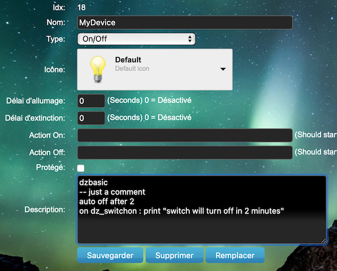

[](https://github.com/casanoe)

# DzBasic

DzBasic is another way for scripting in Domoticz.
It is a very simple Basic like language. It proposes the most essential functionalities and a simple event system.

Its main characteristics are:
- code is stored in the description field of any devices
- it is possible to check or make action on a group of devices in one command
- it contains a more advanced notification system (thanks to [papoo ](https://pon.fr/dzvents-fonction-de-notification-universelle/)for the idea)
- less code to make the most usually commands
- use and simply share more complex dzVents scripts as dzBasic plugin (3 more commands line are enough)

Its weakness is that it is an interpreted language, and can't of course do things like dzVents.
To be used in moderation :)

## Getting Started
First of all, installing dzBasic will not affect any of the scripts you have already in place so you can try dzBasic without disrupting things.

The installation is very easy. Just 2 DzVents files are necessary.

### Prerequisites

dzBasic was developed for [Domoticz](https://www.domoticz.com/), in lua language.
The minimum versions required are:

```
Domoticz    Version: 2020
dzVents     Version: 3.1.5
```

### Installing

The main files are:

```
dzbasic.lua     (main file)
global_data.lua (functions and shared data)
```

Copy and paste the content of these files in the domoticz editor (use dzvents template).

Another way is to copy these 2 files into the domoticz directory:
```domoticz/```


The other files are optional:

```
netatmo.lua     (plugin, get informations from netatmo)
meteo.lua       (plugin, get information from openweathermap)
meteofrance.lua (plugin, get information from meteofrance)
```

## Quick start
After you placed the dzBasic files in the right location we can do a quick test if everything works.

Pick a switch in your Domoticz system. Edit the device and put this code in the description field:

```lua {.line-numbers}
dzbasic
-- just a comment
auto off after 2
on dz_switchon : print "switch %%name%% will turn off in 2 minutes"
```
\

Switch on the device and watch the log. You will have something like that:
```
2021-04-16 00:35:08.968 Dummy: Light/Switch (MyDevice)
2021-04-16 00:35:08.966 Status: User: Admin (IP: 192.168.1.19) initiated a switch command (18/MyDevice/On)
2021-04-16 00:35:09.018 Status: dzVents: switch will turn off in 2 minutes
2021-04-16 00:35:09.023 Status: EventSystem: Script event triggered: /opt/domoticz/dzVents/runtime/dzVents.lua
```

After 2 minutes, the switch turns off automaticaly.

### How it works ?
Every time a device is updated, every minutes and every time a system events is triggered, dzBasic script  is executed.

dzBasic scans every devices (if a timer event or a system event is triggered) or only the updated device, and interprets the code in the description field it can find starting with the word ```dzbasic```.

Example 1:

```lua
dzbasic
-- turn off the device when it has been on for 2 minutes
-- and no motion has been detected by neither of the "motion1" nor the "motion2" device
auto off when minutesago >= 2, state "motion1,motion2" = alloff
```

Example 2:

```lua
dzbasic
-- execute the block 'on/endon' when the switch is turned on
on dz_switchon
  -- print a text in the domoticz log
  print "switch %%name%% is on"
  -- execute the url, and wait the result
  url "http:// domogeek.entropialux.com/vigilance/28/all"
  -- update a text device named 'vigilance'
  -- with the result of the http request (json in this case).
  -- result is recorded in '$$' like a table
  update $$["vigilancerisk"], "vigilance"
endon
```

Example 3:

```lua
dzbasic
$min = 30
-- execute the block when the device has been updated for 30min or more
on minutesago >= $min
  -- call the plugin 'meteo' and stop the code
  call meteo
  -- when the plugin is finished, the code resumes at this point
  -- result is recorded in '$$' variable

  -- update other devices
  update $$["prevision"][2]["meteo"], "Meteo tomorrow"
  update $$["rain"], "Today rain"
  update $$["%rain"][1], "Rain proba in 1h"
  -- update this device
  update $$["meteo"]
endon
```

Example 4: do nothing

```
Description field doesn't begin with the word 'dzbasic'.
This is only a description text. Enjoy !
```

## Syntax

### Variables

A variable begin with a `$`. Example: `$my_variable`.

There are 2 types of variables: local and global.

```lua
let $local_var = "something"
$local_var = "something else"
global $global_var = "hello all"
global $local_var -- $local_var is now global
```

Global variables are visible all the time and from everywhere.
Local variables are destroyed at the end of the interpreted code.

It is possible to clear a variable (local or global):

```lua
clear $var1, $var2, $var3
```

#### Constants

```
$DZ_STARTTIME_SEC   (number of seconds the system is up)
$DZ_LATITUDE        (latitude)
$DZ_LONGITUDE       (longitude)
$DZ_SYSEVENT        (name of the triggered system event, or nil)
$DZ_URL             (Domoticz URL)
```

### Basic commands

The standard commands of the basic language:

```lua
rem comment
-- comment
let $var = <expression>
$var = <expression>
global $var [ = <expression> ]
print <expression>
if <expression> then ... else ... endif
if <expression> : ... <line_break>
for $i = <expression> to <expression> [ step <expression> ] ... next $i
goto label
#label
clear $var
--[[ All text after '--[[' are ignored
Usefull for long description
```
**Limitations:** it is not possible to use a 'if/endif' block in another one

#### functions
A function

```
@event(<expression>)    (return true or false if event is triggered or not)
@string(<expression>)   (convert to string)
@ucase(<expression>)    (convert to uppercase)
@lcase(<expression>)    (convert to lowercase)
@date(<expression>)     (return a formated date)
@rnd(<expression>)      (return a random number between 0 and <expression> number)
@cleanstr(<expression>) (return a string without accent)
@int(<expression>)      (convert to integer)
@script(<expression>)   (execute a script in foreground and return a formated result)
@curl(<expression>)     (execute a url in foreground and return a formated result)
```
For the @date function, see [lua date formated code](http://wxlua.free.fr/Tutoriel_Lua/Tuto/Librairie/codeDate.php). An empty argument return timestamp in seconds.

#### \<expression\>
All lua like expression.
Examples:
```lua
"text"
45265
$a.."my".."text"
$a + 1.2 - ($b * 5)
$a > 1 or $b == 'text'
$b ~= nil
```

### Update devices

```lua
-- only for switch devices
switch <list_of_switch_command> [, "<list_of_device_names>" ] [, <list_of_options> ]
-- change icon
icon <expression_number> [, "<list_of_device_names>"  ]
-- update svalue of a device or level of dimmable light or level of a selector
update <expression> [, "<list_of_device_names>"  ]  
```

#### \<list_of_device_names\>
A comma separated list of device names. Example:
```device1,myswitch,my motion sensor```

**Warning**: a device name is in reality a lua pattern. For example 'myswitch' is equivalent to ```^myswitch.*```. If you want to target only one device named myswitch, put a ```$``` at the end of the device name. The list become:
```device1,myswitch$,my motion sensor```\
For this reason you can add any of the lua pattern rules (except ```^```). For example: ```my%w*%s+room[123]$```

#### \<list_of_switch_command\>
A space separated list of commands:
```on, off, toggle, flash```

#### \<list_of_options\>
A space separated list of commands:
```silent, checkfirst```

Examples:
```lua
switch on , "myswitch1,myswitch2",silent, checkfirst
switch off, "mygroup1"
switch on, "bulb %d room %w*", checkfirst
switch toggle, silent
switch on
```

#### How to use the update command
You can find out which value to use according to the device type in this page:
[Domoticz API reference](https://www.domoticz.com/wiki/Domoticz_API/JSON_URL%27s)

Examples:
```lua
update "hello world", "my_text_device"
update 60, "my_dimmer_light"
update "21", "my_temp_sensor"
update "21,50,0", "my_temp_hum_sensor"
update "Level", "my_selector"
update "A text"
```

### Manage events

Except for the specifics events, you can create and manipulate your own events. The custom events are global, ie visible from everywhere.

#### Custom events:
```lua
-- trigger event_name (default on)
event <event_name> [, on|off]
-- trigger event_name if event_conditions are met
event <event_name> when <event_conditions>
```

#### Events conditions block:
```lua
-- execute code :
-- if certains event_conditions are met
on <event_conditions> : ... <line_break>
on <event_conditions> ... endon
-- if the time_rule matches with the time
at "<time_rule>" : ... <line_break>
-- if the last update was made time_in_minutes ago (or more)
after <time_in_minutes> : ... <line_break>
-- automatic action
auto on|off|toggle ["<list_of_device_names>"] at "<time_rule>"|after <number>|when <event_conditions>
auto update <expression> ["<list_of_device_names>"] at "<time_rule>"|after <number>|when <event_conditions>
auto dim <number>[, <number>] ["<list_of_device_names>"] at "<time_rule>"|after <number>|when <event_conditions>
auto level <level_name>|<number>|"<level_name>" ["<list_of_device_names>"] at "<time_rule>"|after <number>|when <event_conditions>
```
**Limitations:** it is not possible to use a 'on/endon' block in another one

#### \<time_rule\>
See [Domoticz documentation](https://www.domoticz.com/wiki/DzVents:_next_generation_Lua_scripting#timer_trigger_rules)

#### \<event_conditions\>
This is a list of conditions separated by comma.

A condition can be:
```lua
<event_name>
<expression>
time=<expression>
state ["<list_of_device_names>"] =  on | allon | off | alloff
minutesago | secondsago ["<list_of_device_names>"] <comparaison_op> <number>
<event_name> [duration | repeat] <comparaison_op> <number>
```
Examples with the command 'on':
```lua
on dz_switchon : print "Light %%name%% is turned on"
on state "Light number %d" = allon, time = "daytime", secondsago > 120
  switch off,"Light number %d"
  notification "All Lights turned off", PRIORITY="LOW"
endon
```

#### Specific events
A specific event can be used in \<event_name\>\
These events are assigned to the current device.\
These event names are reserved.

```
dz_timer        (every minute)
dz_switchon     (the switch has just been turned on)
dz_switchoff    (the switch has just been turned off)
dz_update       (the switch has just been updated)
dz_level_<name> (the level has just been changed to <name>)
dz_switchlevel  (the level has just been changed)
dz_user         (a custom event has just been triggered - see 'call' and 'run' command)
dz_url          (call back from a http request)
dz_script       (call back from a script request)
dz_sys          (a system event has just been triggered)
dz_sys_<name>   (the system event <name> has just been triggered)
dz_batterylow   (the battery is low)
dz_signallow    (the signal is low)
dz_timedout     (device has not been reached for a long time)
```

### Executions commands

```lua
-- a http(s) request
url "https://site.com" [, fg|bg|cb ] [, <timeout_in_sec> ]
-- execute a script
script "/path/to/prog" [, fg|bg|cb] [, <timeout_in_sec> ]
-- tell another device to execute his dzBasic code
-- trigger event_name and pass the arguments list as local variables
run "<list_of_device_names>" [<event_name>] [, <arguments_list>]
```

#### Options for the script and url command:
```
fg      (execute the command and wait the result)(default)
bg      (execute the command in background)
cb      (execute the command and call back with a specific event dz_url or dz_script)
```
Result is recorded in the special variable ```$$```. It is automaticaly converted in a table for json/xml result.

#### \<arguments_list\>
A comma separated list of ```arg=<expression>```

### Specific commands

```lua
-- internal commands for debug
dzb <command>
-- log to 'dzBasic' text device if exist
log "text"
-- send a notification
notification "message" [, SUBSYSTEMS = "<list_of_sub>"] [, QUIET = "<time_rule>"] [, PRIORITY = LOW|NORMAL|MODERATE|NORMAL|HIGH|EMERGENCY] [, SUBJECT = "text"] [, FREQUENCY = <time_in_minutes>]
```

#### \<list_of_sub>\
A comma separated list of subsystem name.
`CLICKATELL,FIREBASE,FIREBASE_CLOUD_MESSAGING,GOOGLE_DEVICES,HTTP,KODI,LOGITECH_MEDIASERVER, NMA,PROWL,PUSHALOT,PUSHBULLET,PUSHOVER,PUSHSAFER,TELEGRAM,GOOGLE_CLOUD_MESSAGING`

### Call a Plugin
A plugin is a dzvents script callable in dzbasic with the help of a custom event trigger.
The name of the plugin is equal to the name of the custom event (see below).

```lua
call plugin_name [ forceupdate ] [ nocallback ] [, <arguments_list>]
```


## You want to enhance dzBasic ?
### Write a Plugin
It is a standard dzVents script with a custom event whose name is equal to the plugin name.

3 commands lines are enough to build a dzBasic plugin:

```lua
-- Put this line in the beginning of your script, just after the execute function
dz.helpers.load_dzBasicLibs(domoticz)
-- This line is optional. The command permit to get the arguments passed to the plugin
local context = dzBasicCall_getData('myplugin')
-- if yo want to return a value to the dzBasic script, put this line
-- <timeout> is the time in second during which the value remains valid
dzBasicCall_return('myplugin', <value_to_return>, <timeout>)
```

Example:
```lua
return {
    on = {
        customEvents = { 'myplugin' }
    },
    execute = function(dz, triggeredItem, info)
        dz.helpers.load_dzBasicLibs(dz)
        -- time to live of the data result
        -- 0 : infinite ; nil : update always
        local TIMEOUT = 60 * 30
        local context = dzBasicCall_getData('myplugin')
        local args = context['args']
        -- plugin code
        print(args['message'])
        -- end of plugin code
        local r = "pong from myplugin"
        dzBasicCall_return('myplugin', r, TIMEOUT)
    end
}
```

And the dzBasic code:
```lua
dzbasic
on dz_switchon
  call myplugin, message="switch on device %%name%%, ping from dzbasic"
  print $$
endon
```

If you switch on the device, the result will be visible in the domoticz log:
```
2021-04-24 17:30:25.410 Dummy: Light/Switch (test3)
2021-04-24 17:30:25.409 Status: User: Admin (IP: 192.168.1.26) initiated a switch command (20/test3/On)
2021-04-24 17:30:25.465 Status: EventSystem: Script event triggered: /opt/domoticz/dzVents/runtime/dzVents.lua
2021-04-24 17:30:25.518 Status: dzVents: switch on device test3, ping from dzbasic
2021-04-24 17:30:25.519 Status: EventSystem: Script event triggered: /opt/domoticz/dzVents/runtime/dzVents.lua
2021-04-24 17:30:25.596 Status: dzVents: pong from myplugin
```

### Write a new command or a new function

Just add a lua function in the dzBasic script. The name of this function is important:
- begining with 'f_' for a dzbasic function: `function f_mydzbasicfunc(s) return 'hello world' end`
- beginning with 'w_' for a dzbasic command: `function w_mycommand() <command_code> end`

#### \<command_code\>
TODO\
See dzbasic code for examples


## Contributing

Please read [CONTRIBUTING.md](https://gist.github.com/PurpleBooth/b24679402957c63ec426) for details on our code of conduct, and the process for submitting pull requests to us.

## Authors

* **Cyril** - *Creation* - [CasaNoe](https://github.com/casanoe)

## License

This project is licensed under the MIT License - see the [LICENSE.md](LICENSE.md) file for details

## Acknowledgments


## DzBasic version History
### [1.0 beta]
Date: 25 April 2021
- First version, first beta
- Simple event system
- Simple basic commands
- Plugin system
